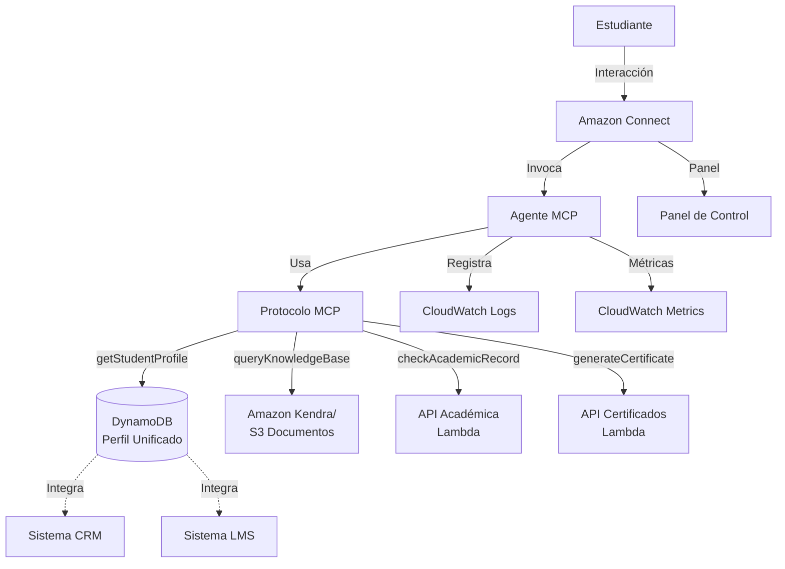

# Documento de Diseño: Agente de IA MCP para Amazon Connect - Educación Superior

## Resumen General

Este documento describe el diseño de un agente de inteligencia artificial basado en el Protocolo de Contexto de Modelo (MCP) integrado con Amazon Connect, específicamente adaptado para instituciones de educación superior. El sistema proporciona atención personalizada a estudiantes mediante el acceso a perfiles unificados, bases de conocimiento, historiales académicos y la automatización de trámites administrativos.

El agente actúa como punto de contacto principal para estudiantes, ofreciendo:
- Identificación y saludo personalizado
- Respuestas inteligentes sobre programas académicos
- Asistencia académica proactiva basada en el contexto del estudiante
- Automatización completa de trámites como generación de certificados

## Arquitectura

### Arquitectura de Alto Nivel



### Componentes Principales

1. **Amazon Connect**: Plataforma de centro de contacto que gestiona las interacciones con estudiantes
2. **Agente MCP**: Motor de IA que procesa solicitudes y ejecuta lógica de negocio
3. **Protocolo MCP**: Capa de abstracción que expone herramientas para interactuar con servicios
4. **Servicios de Datos**: DynamoDB, Amazon Kendra/S3, APIs Lambda
5. **Sistemas Externos**: CRM y LMS institucionales

### Flujo de Interacción

1. Estudiante inicia contacto a través de Amazon Connect
2. Amazon Connect invoca el Agente MCP
3. Agente identifica al estudiante y recupera su perfil unificado
4. Agente procesa la solicitud del estudiante usando herramientas MCP
5. Agente ejecuta acciones (consultas, generación de documentos, etc.)
6. Agente responde al estudiante con información o confirmación
7. Interacción se registra en CloudWatch para análisis

## Componentes e Interfaces

### Herramientas MCP

#### 1. getStudentProfile

**Propósito**: Recuperar el perfil unificado del estudiante desde DynamoDB

**Entrada**:
```typescript
interface GetStudentProfileInput {
  studentId: string;          // Identificador único del estudiante
  includeAcademic?: boolean;  // Incluir datos académicos básicos
  includeCRM?: boolean;       // Incluir datos de CRM
}
```

**Salida**:
```typescript
interface StudentProfile {
  studentId: string;
  firstName: string;
  lastName: string;
  email: string;
  phone: string;
  program?: {
    name: string;
    code: string;
    enrollmentDate: string;
  };
  academicStatus?: string;    // "active" | "inactive" | "graduated"
  crmData?: {
    lastContact: string;
    preferredChannel: string;
    tags: string[];
  };
}
```

**Manejo de Errores**:
- `StudentNotFound`: Estudiante no existe en el sistema
- `ServiceUnavailable`: DynamoDB no disponible
- `InvalidStudentId`: Formato de ID inválido

#### 2. queryKnowledgeBase

**Propósito**: Buscar información en la base de conocimiento sobre programas, requisitos y procedimientos

**Entrada**:
```typescript
interface QueryKnowledgeBaseInput {
  query: string;              // Pregunta o términos de búsqueda
  maxResults?: number;        // Número máximo de resultados (default: 5)
  filters?: {
    documentType?: string[];  // ["program", "faq", "procedure"]
    program?: string;         // Filtrar por programa específico
  };
}
```

**Salida**:
```typescript
interface KnowledgeBaseResult {
  results: Array<{
    title: string;
    excerpt: string;
    relevanceScore: number;
    source: string;           // URL o referencia del documento
    documentType: string;
  }>;
  totalResults: number;
}
```

**Manejo de Errores**:
- `EmptyQuery`: Query vacío o inválido
- `ServiceUnavailable`: Kendra/S3 no disponible
- `NoResultsFound`: No se encontraron resultados

#### 3. checkAcademicRecord

**Propósito**: Consultar el historial académico del estudiante

**Entrada**:
```typescript
interface CheckAcademicRecordInput {
  studentId: string;
  includeCourses?: boolean;   // Incluir lista de materias
  includeGrades?: boolean;    // Incluir calificaciones
  semester?: string;          // Filtrar por semestre específico
}
```

**Salida**:
```typescript
interface AcademicRecord {
  studentId: string;
  gpa: number;
  totalCredits: number;
  completedCredits: number;
  academicStanding: string;   // "good" | "probation" | "warning"
  courses?: Array<{
    courseCode: string;
    courseName: string;
    semester: string;
    grade: string;
    status: string;           // "passed" | "failed" | "in_progress"
    credits: number;
  }>;
  alerts?: Array<{
    type: string;             // "failed_course" | "low_gpa" | "missing_credits"
    message: string;
    severity: string;         // "high" | "medium" | "low"
  }>;
}
```

**Manejo de Errores**:
- `StudentNotFound`: Estudiante no tiene historial académico
- `ServiceUnavailable`: API académica no disponible
- `InvalidStudentId`: Formato de ID inválido

#### 4. generateCertificate

**Propósito**: Generar y enviar certificados académicos

**Entrada**:
```typescript
interface GenerateCertificateInput {
  studentId: string;
  certificateType: string;    // "enrollment" | "grades" | "graduation"
  deliveryMethod: string;     // "email" | "download"
  language?: string;          // "es" | "en" (default: "es")
}
```

**Salida**:
```typescript
interface GenerateCertificateResult {
  certificateId: string;
  status: string;             // "generated" | "sent" | "failed"
  generatedAt: string;
  deliveryStatus?: {
    method: string;
    destination: string;
    sentAt?: string;
  };
  downloadUrl?: string;       // URL temporal si deliveryMethod es "download"
  expiresAt?: string;         // Expiración de URL temporal
}
```

**Manejo de Errores**:
- `StudentHasDebts`: Estudiante tiene deudas pendientes
- `InvalidCertificateType`: Tipo de certificado no válido
- `GenerationFailed`: Error al generar el PDF
- `DeliveryFailed`: Error al enviar el certificado

### Interfaz del Agente MCP

#### Procesamiento de Conversación

```typescript
interface ConversationContext {
  sessionId: string;
  studentId?: string;
  studentProfile?: StudentProfile;
  conversationHistory: Message[];
  currentIntent?: string;
  entities: Map<string, any>;
}

interface Message {
  role: "user" | "assistant";
  content: string;
  timestamp: string;
}

interface AgentResponse {
  message: string;
  actions?: Action[];
  requiresHumanEscalation: boolean;
  metadata?: {
    toolsUsed: string[];
    processingTime: number;
  };
}

interface Action {
  type: string;              // "tool_call" | "transfer" | "end_conversation"
  toolName?: string;
  parameters?: any;
  result?: any;
}
```

#### Lógica de Razonamiento

El agente implementa un ciclo de razonamiento que:

1. **Identifica la intención**: Analiza el mensaje del estudiante para determinar qué necesita
2. **Recupera contexto**: Obtiene perfil y datos relevantes usando herramientas MCP
3. **Analiza situación**: Evalúa el contexto académico y personal del estudiante
4. **Determina acciones**: Decide qué herramientas MCP invocar y en qué orden
5. **Ejecuta acciones**: Llama a las herramientas MCP necesarias
6. **Genera respuesta**: Construye una respuesta personalizada y contextualizada
7. **Evalúa proactividad**: Identifica oportunidades para ofrecer ayuda adicional

## Modelos de Datos

### Perfil Unificado (DynamoDB)

```typescript
interface UnifiedProfile {
  // Clave de partición
  PK: string;                 // "STUDENT#{studentId}"
  SK: string;                 // "PROFILE"
  
  // Datos básicos
  studentId: string;
  firstName: string;
  lastName: string;
  email: string;
  phone: string;
  identificationNumber: string;
  
  // Datos académicos
  program: {
    code: string;
    name: string;
    faculty: string;
    enrollmentDate: string;
    expectedGraduationDate?: string;
  };
  academicStatus: string;
  
  // Datos CRM
  crmData: {
    lastContactDate: string;
    lastContactChannel: string;
    preferredLanguage: string;
    communicationPreferences: string[];
    tags: string[];
    notes?: string;
  };
  
  // Datos LMS
  lmsData: {
    userId: string;
    lastLoginDate: string;
    activeCourses: number;
    completionRate: number;
  };
  
  // Metadatos
  createdAt: string;
  updatedAt: string;
  version: number;
}
```

### Historial Académico (API Response)

```typescript
interface AcademicHistory {
  studentId: string;
  program: string;
  
  // Resumen académico
  summary: {
    gpa: number;
    totalCredits: number;
    completedCredits: number;
    remainingCredits: number;
    academicStanding: string;
    semestersCompleted: number;
  };
  
  // Materias por semestre
  semesters: Array<{
    semesterCode: string;
    year: number;
    period: string;           // "1" | "2" | "summer"
    courses: Array<{
      courseCode: string;
      courseName: string;
      credits: number;
      grade: string;
      numericGrade: number;
      status: string;
      professor: string;
    }>;
    semesterGPA: number;
  }>;
  
  // Alertas académicas
  alerts: Array<{
    alertId: string;
    type: string;
    severity: string;
    message: string;
    createdAt: string;
    resolved: boolean;
  }>;
  
  // Deudas y bloqueos
  financialStatus: {
    hasDebts: boolean;
    debtAmount?: number;
    blockedServices: string[];
  };
}
```

### Base de Conocimiento (Kendra/S3)

```typescript
interface KnowledgeDocument {
  documentId: string;
  title: string;
  documentType: string;       // "program" | "faq" | "procedure" | "policy"
  content: string;
  
  // Metadatos para búsqueda
  metadata: {
    program?: string;
    faculty?: string;
    category: string;
    keywords: string[];
    lastUpdated: string;
    version: string;
  };
  
  // Ubicación
  source: {
    bucket: string;
    key: string;
    url: string;
  };
}
```

### Certificado

```typescript
interface Certificate {
  certificateId: string;
  studentId: string;
  certificateType: string;
  
  // Datos del certificado
  data: {
    studentName: string;
    identificationNumber: string;
    program: string;
    issueDate: string;
    validUntil?: string;
    additionalInfo: any;      // Específico por tipo de certificado
  };
  
  // Generación y entrega
  generation: {
    generatedAt: string;
    generatedBy: string;      // "system" | userId
    pdfUrl: string;
    pdfSize: number;
  };
  
  delivery: {
    method: string;
    destination: string;
    status: string;
    sentAt?: string;
    attempts: number;
  };
  
  // Seguridad
  verification: {
    verificationCode: string;
    qrCode: string;
    digitalSignature: string;
  };
  
  // Auditoría
  audit: {
    createdAt: string;
    accessLog: Array<{
      timestamp: string;
      action: string;
      userId?: string;
    }>;
  };
}
```

### Sesión de Conversación

```typescript
interface ConversationSession {
  sessionId: string;
  studentId?: string;
  
  // Estado de la conversación
  status: string;             // "active" | "completed" | "escalated"
  startTime: string;
  endTime?: string;
  duration?: number;
  
  // Mensajes
  messages: Array<{
    messageId: string;
    role: string;
    content: string;
    timestamp: string;
  }>;
  
  // Contexto
  context: {
    currentIntent?: string;
    entities: Record<string, any>;
    toolsUsed: string[];
    actionsCompleted: string[];
  };
  
  // Métricas
  metrics: {
    messageCount: number;
    toolCallCount: number;
    averageResponseTime: number;
    satisfactionScore?: number;
  };
  
  // Escalamiento
  escalation?: {
    reason: string;
    timestamp: string;
    agentId?: string;
  };
}
```


## Propiedades de Corrección

*Una propiedad es una característica o comportamiento que debe mantenerse verdadero en todas las ejecuciones válidas de un sistema - esencialmente, una declaración formal sobre lo que el sistema debe hacer. Las propiedades sirven como puente entre las especificaciones legibles por humanos y las garantías de corrección verificables por máquinas.*

### Propiedades de Identificación y Perfil

**Propiedad 1: Recuperación de perfil al iniciar conversación**
*Para cualquier* estudiante que inicie una conversación, el sistema debe invocar la herramienta MCP getStudentProfile con el identificador del estudiante.
**Valida: Requisitos 1.1**

**Propiedad 2: Saludo con nombre completo**
*Para cualquier* perfil de estudiante recuperado exitosamente, el mensaje de saludo debe contener el nombre completo del estudiante (firstName + lastName).
**Valida: Requisitos 1.2**

**Propiedad 3: Mención de programa en saludo**
*Para cualquier* perfil de estudiante que contenga información de programa académico, el mensaje de saludo debe mencionar el nombre del programa.
**Valida: Requisitos 1.3**

**Propiedad 4: Persistencia de contexto de perfil**
*Para cualquier* sesión de conversación activa, el perfil unificado del estudiante debe permanecer accesible en todos los turnos de la conversación sin requerir recuperación adicional.
**Valida: Requisitos 1.5**

**Propiedad 5: Integración de datos CRM y LMS**
*Para cualquier* estudiante, el perfil unificado generado debe contener tanto datos del CRM como datos del LMS cuando ambos estén disponibles.
**Valida: Requisitos 2.1**

**Propiedad 6: Caché de perfil en sesión**
*Para cualquier* sesión activa, múltiples accesos al perfil del estudiante no deben generar múltiples llamadas a getStudentProfile - el perfil debe ser cacheado.
**Valida: Requisitos 2.3**

**Propiedad 7: Confirmación ante datos contradictorios**
*Para cualquier* información proporcionada por el estudiante que contradiga datos en el perfil unificado, el sistema debe solicitar confirmación explícita antes de proceder.
**Valida: Requisitos 2.4**

**Propiedad 8: Uso de herramienta correcta para perfil**
*Para cualquier* acceso a datos del estudiante, el sistema debe utilizar la herramienta MCP getStudentProfile y no métodos alternativos.
**Valida: Requisitos 2.5**

### Propiedades de Base de Conocimiento

**Propiedad 9: Uso de queryKnowledgeBase para consultas académicas**
*Para cualquier* consulta sobre programas académicos, requisitos o procedimientos, el sistema debe invocar la herramienta MCP queryKnowledgeBase.
**Valida: Requisitos 3.1**

**Propiedad 10: Respuesta a consultas de información académica**
*Para cualquier* pregunta sobre información académica (pensum, requisitos de admisión, fechas de inscripción), el sistema debe buscar en la base de conocimiento y proporcionar una respuesta basada en los resultados.
**Valida: Requisitos 3.2, 3.3, 3.4**

**Propiedad 11: Citación de fuentes**
*Para cualquier* respuesta basada en documentos de la base de conocimiento, el mensaje debe incluir una referencia a la fuente del documento (título o URL).
**Valida: Requisitos 3.6**

### Propiedades de Historial Académico

**Propiedad 12: Uso de checkAcademicRecord para contexto académico**
*Para cualquier* solicitud que requiera contexto académico del estudiante (calificaciones, materias, estado), el sistema debe invocar la herramienta MCP checkAcademicRecord.
**Valida: Requisitos 4.1**

### Propiedades de Asistencia Proactiva

**Propiedad 13: Oferta de tutoría ante calificaciones reprobadas**
*Para cualquier* historial académico que contenga al menos una materia reprobada, el sistema debe ofrecer opciones de tutoría o cursos de refuerzo en su respuesta.
**Valida: Requisitos 5.1**

**Propiedad 14: Sugerencia de recursos ante materias en riesgo**
*Para cualquier* historial académico que contenga alertas de materias en riesgo, el sistema debe sugerir recursos académicos disponibles.
**Valida: Requisitos 5.2**

**Propiedad 15: Análisis preventivo de impedimentos**
*Para cualquier* solicitud de trámite, el sistema debe consultar el historial académico y el estado financiero para identificar posibles impedimentos antes de proceder.
**Valida: Requisitos 5.3**

**Propiedad 16: Oferta de cursos de verano**
*Para cualquier* historial académico con materias reprobadas, el sistema debe ofrecer inscripción a cursos de verano como opción de recuperación.
**Valida: Requisitos 5.4**

### Propiedades de Generación de Certificados

**Propiedad 17: Verificación de identidad para certificados**
*Para cualquier* solicitud de certificado, el sistema debe verificar la identidad del estudiante consultando el perfil unificado antes de proceder con la generación.
**Valida: Requisitos 6.1**

**Propiedad 18: Consulta de deudas después de verificación**
*Para cualquier* solicitud de certificado donde la identidad fue verificada, el sistema debe consultar el estado financiero del estudiante para detectar deudas pendientes.
**Valida: Requisitos 6.2**

**Propiedad 19: Bloqueo por deudas**
*Para cualquier* estudiante con deudas pendientes (hasDebts = true), el sistema no debe generar el certificado y debe informar al estudiante sobre la deuda.
**Valida: Requisitos 6.3**

**Propiedad 20: Generación con herramienta correcta**
*Para cualquier* estudiante sin impedimentos, el sistema debe invocar la herramienta MCP generateCertificate para crear el certificado.
**Valida: Requisitos 6.4**

**Propiedad 21: Entrega y confirmación de certificado**
*Para cualquier* certificado generado exitosamente (status = "generated" o "sent"), el sistema debe enviar el documento al email del estudiante y confirmar la entrega en su respuesta.
**Valida: Requisitos 6.5, 6.6**

### Propiedades de Automatización de Trámites

**Propiedad 22: Identificación de tipo de trámite**
*Para cualquier* solicitud de trámite, el sistema debe clasificar correctamente el tipo de trámite solicitado antes de proceder.
**Valida: Requisitos 7.1**

**Propiedad 23: Validación de requisitos**
*Para cualquier* trámite solicitado, el sistema debe validar que el estudiante cumple todos los requisitos necesarios antes de ejecutar el trámite.
**Valida: Requisitos 7.2**

**Propiedad 24: Ejecución con herramientas MCP**
*Para cualquier* trámite donde los requisitos son cumplidos, el sistema debe ejecutar el trámite utilizando las herramientas MCP correspondientes.
**Valida: Requisitos 7.3**

**Propiedad 25: Ejecución secuencial de pasos**
*Para cualquier* trámite que requiera múltiples pasos, el sistema debe completar todos los pasos en el orden correcto sin omitir ninguno.
**Valida: Requisitos 7.4**

**Propiedad 26: Comunicación de estado del trámite**
*Para cualquier* trámite en ejecución, el sistema debe comunicar el estado actual en cada fase (iniciado, en progreso, completado) al estudiante.
**Valida: Requisitos 7.5, 7.6**

### Propiedades de Manejo de Errores

**Propiedad 27: Mensajes de error no técnicos**
*Para cualquier* fallo de herramienta MCP, el mensaje de error presentado al estudiante no debe contener términos técnicos (stack traces, códigos de error internos, nombres de servicios).
**Valida: Requisitos 8.1**

**Propiedad 28: Alternativas ante servicios no disponibles**
*Para cualquier* servicio externo no disponible, el sistema debe ofrecer al menos una alternativa (contacto humano, reintentar más tarde, método alternativo) en su respuesta.
**Valida: Requisitos 8.2**

**Propiedad 29: Explicación y opciones ante fallos**
*Para cualquier* solicitud que no pueda completarse, el sistema debe explicar la razón del fallo y ofrecer al menos una opción alternativa.
**Valida: Requisitos 8.3**

**Propiedad 30: Registro de errores**
*Para cualquier* error que ocurra durante la ejecución, el sistema debe registrar el error en los logs con información suficiente para análisis posterior (timestamp, tipo de error, contexto).
**Valida: Requisitos 8.4**

**Propiedad 31: Escalamiento ante errores críticos**
*Para cualquier* error clasificado como crítico, el sistema debe ofrecer transferencia a un agente humano en su respuesta.
**Valida: Requisitos 8.5**

### Propiedades de Integración y Auditoría

**Propiedad 32: Registro de interacciones**
*Para cualquier* interacción con un estudiante, el sistema debe registrar la conversación completa en Amazon Connect para análisis posterior.
**Valida: Requisitos 9.2**

**Propiedad 33: Autenticación antes de datos sensibles**
*Para cualquier* acceso a datos sensibles (historial académico, datos financieros, información personal), el sistema debe verificar la autenticación del estudiante primero.
**Valida: Requisitos 10.1**

**Propiedad 34: Auditoría de accesos sensibles**
*Para cualquier* acceso a información sensible, el sistema debe registrar el evento de acceso con timestamp, studentId y tipo de información accedida.
**Valida: Requisitos 10.4**

**Propiedad 35: Bloqueo de accesos no autorizados**
*Para cualquier* intento de acceso no autorizado detectado, el sistema debe bloquear la solicitud, no proporcionar información y registrar el evento de seguridad.
**Valida: Requisitos 10.5**

## Manejo de Errores

### Estrategia General

El sistema implementa un enfoque de manejo de errores en capas:

1. **Capa de Herramientas MCP**: Cada herramienta captura errores específicos de su dominio
2. **Capa de Agente**: El agente traduce errores técnicos a mensajes comprensibles
3. **Capa de Presentación**: Los mensajes se formatean apropiadamente para el estudiante

### Tipos de Errores y Respuestas

#### Errores de Datos No Encontrados

**Escenario**: Estudiante no existe, historial no disponible, documento no encontrado

**Manejo**:
- Verificar identidad del estudiante
- Ofrecer métodos alternativos de búsqueda
- Sugerir contacto con oficina de registro si persiste

**Ejemplo de respuesta**:
```
"No pude encontrar tu perfil con la información proporcionada. ¿Podrías confirmar tu número de identificación? También puedo transferirte con un asesor que te ayudará directamente."
```

#### Errores de Servicios No Disponibles

**Escenario**: DynamoDB timeout, Kendra no responde, API académica caída

**Manejo**:
- Detectar timeout o error de conexión
- Informar al estudiante sin detalles técnicos
- Ofrecer reintentar o alternativa
- Registrar para monitoreo

**Ejemplo de respuesta**:
```
"En este momento estoy teniendo dificultades para acceder a tu información académica. ¿Podemos intentar de nuevo en unos minutos? Si es urgente, puedo transferirte con un asesor."
```

#### Errores de Validación de Negocio

**Escenario**: Estudiante con deudas, no cumple requisitos, trámite no permitido

**Manejo**:
- Explicar claramente la razón del bloqueo
- Proporcionar pasos para resolver el impedimento
- Ofrecer información de contacto relevante

**Ejemplo de respuesta**:
```
"Veo que tienes un saldo pendiente de $500. Para generar tu certificado, necesitas estar al día con tus pagos. Puedes realizar el pago en línea en [URL] o acercarte a la oficina de tesorería."
```

#### Errores Críticos del Sistema

**Escenario**: Excepción no manejada, fallo de múltiples servicios, error de lógica

**Manejo**:
- Capturar excepción en nivel superior
- Registrar stack trace completo para debugging
- Ofrecer transferencia inmediata a agente humano
- No exponer detalles técnicos al estudiante

**Ejemplo de respuesta**:
```
"Disculpa, estoy experimentando un problema técnico. Déjame transferirte con un asesor que podrá ayudarte de inmediato."
```

### Reintentos y Recuperación

**Política de Reintentos**:
- Herramientas MCP: 3 reintentos con backoff exponencial (1s, 2s, 4s)
- Timeout por llamada: 10 segundos
- Timeout total de sesión: 5 minutos

**Recuperación Parcial**:
- Si una herramienta falla pero otras funcionan, continuar con funcionalidad reducida
- Informar al estudiante sobre limitaciones temporales
- Ofrecer completar la solicitud cuando el servicio se recupere

### Logging y Monitoreo

**Niveles de Log**:
- ERROR: Fallos de herramientas, excepciones, errores de validación
- WARN: Timeouts, reintentos, servicios degradados
- INFO: Inicio/fin de conversación, llamadas a herramientas exitosas
- DEBUG: Detalles de request/response de herramientas

**Métricas Clave**:
- Tasa de error por herramienta MCP
- Tiempo de respuesta promedio
- Tasa de escalamiento a agentes humanos
- Tasa de éxito de trámites completados

## Estrategia de Testing

### Enfoque Dual de Testing

El sistema requiere dos tipos complementarios de pruebas para garantizar corrección completa:

1. **Pruebas Unitarias**: Verifican ejemplos específicos, casos extremos y condiciones de error
2. **Pruebas Basadas en Propiedades**: Verifican propiedades universales a través de múltiples entradas generadas

Ambos tipos son necesarios y complementarios:
- Las pruebas unitarias capturan bugs concretos y validan comportamientos específicos
- Las pruebas de propiedades verifican corrección general y descubren casos extremos inesperados

### Configuración de Pruebas Basadas en Propiedades

**Biblioteca Recomendada**: 
- Para TypeScript/JavaScript: `fast-check`
- Para Python: `hypothesis`

**Configuración de Ejecución**:
- Mínimo 100 iteraciones por prueba de propiedad (debido a la aleatorización)
- Cada prueba debe referenciar su propiedad del documento de diseño
- Formato de etiqueta: **Feature: amazon-connect-education-agent, Property {número}: {texto de propiedad}**

**Balance de Pruebas**:
- Evitar escribir demasiadas pruebas unitarias - las pruebas de propiedades manejan la cobertura de múltiples entradas
- Las pruebas unitarias deben enfocarse en:
  - Ejemplos específicos que demuestran comportamiento correcto
  - Puntos de integración entre componentes
  - Casos extremos y condiciones de error
- Las pruebas de propiedades deben enfocarse en:
  - Propiedades universales que se mantienen para todas las entradas
  - Cobertura exhaustiva de entradas mediante aleatorización

### Estrategia por Componente

#### Herramientas MCP

**Pruebas Unitarias**:
- Casos de éxito con datos válidos
- Casos de error (estudiante no encontrado, servicio no disponible)
- Validación de formato de entrada/salida
- Manejo de timeouts

**Pruebas de Propiedades**:
- Propiedad 8: Uso correcto de getStudentProfile
- Propiedad 9: Uso correcto de queryKnowledgeBase
- Propiedad 12: Uso correcto de checkAcademicRecord
- Propiedad 20: Uso correcto de generateCertificate

**Generadores Necesarios**:
```typescript
// Generador de IDs de estudiante válidos
arbitrary.studentId(): string

// Generador de perfiles de estudiante
arbitrary.studentProfile(): StudentProfile

// Generador de consultas de conocimiento
arbitrary.knowledgeQuery(): string

// Generador de historiales académicos
arbitrary.academicRecord(): AcademicRecord
```

#### Lógica de Conversación

**Pruebas Unitarias**:
- Flujo de saludo inicial
- Manejo de intenciones específicas (solicitar certificado, consultar programa)
- Transiciones de estado de conversación
- Escalamiento a agente humano

**Pruebas de Propiedades**:
- Propiedad 1: Recuperación de perfil al iniciar
- Propiedad 2: Saludo con nombre completo
- Propiedad 3: Mención de programa en saludo
- Propiedad 4: Persistencia de contexto
- Propiedad 7: Confirmación ante datos contradictorios

**Generadores Necesarios**:
```typescript
// Generador de mensajes de usuario
arbitrary.userMessage(): string

// Generador de contextos de conversación
arbitrary.conversationContext(): ConversationContext

// Generador de intenciones
arbitrary.intent(): string
```

#### Asistencia Proactiva

**Pruebas Unitarias**:
- Detección de materia reprobada específica
- Oferta de tutoría para caso concreto
- Detección de múltiples alertas académicas

**Pruebas de Propiedades**:
- Propiedad 13: Oferta de tutoría ante reprobadas
- Propiedad 14: Sugerencia de recursos ante riesgo
- Propiedad 15: Análisis preventivo de impedimentos
- Propiedad 16: Oferta de cursos de verano

**Generadores Necesarios**:
```typescript
// Generador de historiales con problemas académicos
arbitrary.academicRecordWithIssues(): AcademicRecord

// Generador de alertas académicas
arbitrary.academicAlert(): Alert
```

#### Generación de Certificados

**Pruebas Unitarias**:
- Flujo completo exitoso de certificado
- Bloqueo por deudas específicas
- Fallo en generación de PDF
- Fallo en envío de email

**Pruebas de Propiedades**:
- Propiedad 17: Verificación de identidad
- Propiedad 18: Consulta de deudas
- Propiedad 19: Bloqueo por deudas
- Propiedad 20: Generación con herramienta correcta
- Propiedad 21: Entrega y confirmación

**Generadores Necesarios**:
```typescript
// Generador de estudiantes con/sin deudas
arbitrary.studentWithDebtStatus(): { student: StudentProfile, hasDebts: boolean }

// Generador de tipos de certificado
arbitrary.certificateType(): string

// Generador de solicitudes de certificado
arbitrary.certificateRequest(): GenerateCertificateInput
```

#### Manejo de Errores

**Pruebas Unitarias**:
- Error específico de DynamoDB
- Error específico de Kendra
- Error de timeout en API académica
- Múltiples fallos simultáneos

**Pruebas de Propiedades**:
- Propiedad 27: Mensajes no técnicos
- Propiedad 28: Alternativas ante indisponibilidad
- Propiedad 29: Explicación y opciones
- Propiedad 30: Registro de errores
- Propiedad 31: Escalamiento ante críticos

**Generadores Necesarios**:
```typescript
// Generador de tipos de error
arbitrary.errorType(): Error

// Generador de fallos de herramientas
arbitrary.toolFailure(): { tool: string, error: Error }
```

### Pruebas de Integración

**Escenarios End-to-End**:
1. Estudiante solicita certificado → Sistema verifica identidad → Consulta deudas → Genera y envía certificado
2. Estudiante pregunta sobre programa → Sistema busca en conocimiento → Responde con información citada
3. Estudiante con materia reprobada → Sistema detecta → Ofrece curso de verano → Ayuda a inscribirse
4. Servicio no disponible → Sistema detecta → Ofrece alternativa → Registra error

**Ambiente de Pruebas**:
- Mocks de servicios AWS (DynamoDB, Kendra, Lambda)
- Datos de prueba representativos
- Simulación de latencias y fallos

### Cobertura de Código

**Objetivos**:
- Cobertura de líneas: >80%
- Cobertura de ramas: >75%
- Cobertura de funciones: >90%

**Áreas Críticas** (requieren 100% de cobertura):
- Validación de identidad
- Manejo de datos sensibles
- Lógica de bloqueo por deudas
- Manejo de errores críticos

### Pruebas de Seguridad

**Validaciones**:
- Intentos de acceso sin autenticación
- Inyección en queries de conocimiento
- Manipulación de IDs de estudiante
- Acceso a datos de otros estudiantes

**Herramientas**:
- Análisis estático de código (ESLint con reglas de seguridad)
- Escaneo de dependencias (npm audit, Snyk)
- Pruebas de penetración en ambiente de staging

### Monitoreo en Producción

**Métricas de Calidad**:
- Tasa de error por tipo de herramienta
- Tiempo de respuesta percentil 95
- Tasa de escalamiento a humanos
- Satisfacción del estudiante (encuestas post-interacción)

**Alertas**:
- Tasa de error >5% en cualquier herramienta
- Tiempo de respuesta >3 segundos
- Tasa de escalamiento >20%
- Caída de cualquier servicio externo
